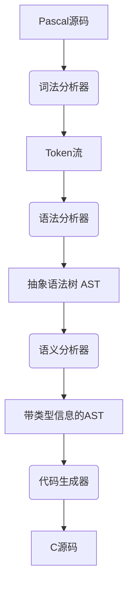

# Pascal to C 编译器 (pascc) 设计文档

## 1. 项目概述
### 1.1 项目背景
针对将遗留Pascal系统迁移到现代平台的需求，设计实现一个轻量级Pascal到C语言转换编译器。支持ISO 7185 Pascal子集，生成符合ANSI C89标准的可移植代码。

### 1.2 设计目标
- **准确性**：保持Pascal语义在C代码中的等价转换
- **可读性**：生成具备良好格式和注释的C代码
- **可扩展性**：模块化设计便于新增Pascal语法特性
- **跨平台**：支持Windows/Linux/macOS编译环境

---

## 2. 系统架构


---
## 3.编译步骤
```bash
mkdir build 
cd build
cmake ..     # 生成Makefile
make         # 编译项目
cd bin       # 生成的可执行文件位于此目录